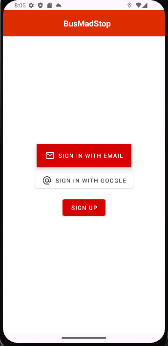
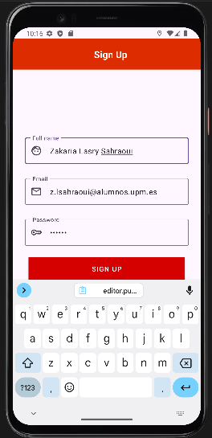
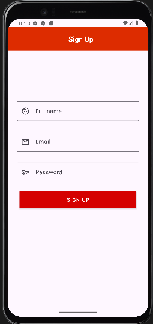
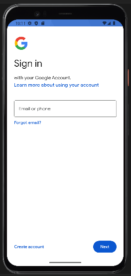

# MadBusStop

## Workspace
Github:
- Repository: https://github.com/btabuenca/HelloWorldKt/
- Releases: https://github.com/btabuenca/HelloWorldKt/releases
- Workspace: https://upm365.sharepoint.com/sites/MobileAppSite .


## Description
A brief introduction to what your app does and why it's useful. Explain how it enhances the experience within its scope (e.g., finding green routes to walk in Madrid) and any unique features it offers. Compare and contrast with already existing apps in the markets (Google Play or AppStore iOS).

## Screenshots and navigation
<table>
  <tr>
    <td>
      
      <p align="center">First Screen</p>
    </td>
    <td>
      
      <p align="center">Sign Up</p>
    </td>
  </tr>
  <tr>
    <td>
      
      <p align="center">Sign In Screen</p>
    </td>
    <td>
      
      <p align="center">Google Sign In Screen</p>
    </td>
  </tr>
  <tr>
    <td>
      
      <p align="center">Main Activity Screen</p>
    </td>
    <td>
    </td>
  </tr>
</table>


## Demo Video
Video demonstrating how the app works (Max 1 video of 1 minute), upload it to a platform like YouTube or Vimeo (it might also work with Stream) and link it here:  
<a href="https://vimeo.com/410664338?share=copy">

</a>

## Features
List the **functional** features of the app. For example:
- Search for common routes in Madrid.
- Filters by transport type.
- Interactive maps.
- Real-time traffic information.

List the **technical** features of the app. You might include specific references to source code
in your repo. For example:
- Persistence in csv/text file
- Persistence in shared preferences
- Persistence in Room database. Ref: [Source code](https://github.com/btabuenca/HelloWorldKt/blob/268a3367296238c76ec1baa18d0b5d268a49235f/app/src/main/java/es/upm/btb/helloworldkt/persistence/room/LocationEntity.kt#L6 "LocationEntity")
- Firebase Realtime database
- Firebase authentication
- Maps: Openstreetmaps or Google maps
- Resful APIs used (*e.g., Openwheathermaps https://openweathermap.org/api .Describe the api here*).
- Menu: *e.g., Toolbar*
- Images: *e.g. glide or picasso library*
- Sensors: *e.g., GPS coordinates, noise meter, light meter, compass, gyroscope, ...*
- ...

## How to Use
Provide instructions on how to get started with the app as user.

## Additional section
You might describe any additional section you might consider necessary. Remove this if not necessary.

## Participants
List of MAD developers:
- Name SecondName Member1 (emailmemmber1@alumunos.upm.es)
- Name SecondName Member1 (emailmemmber1@alumunos.upm.es)


Workload distribution between members: (Percentage member1 / Percentage member 2) . *Please only specify in case of unevenly balanced workload distribution long the project e.g., (60%/40%). If not specified 50%/50% will be assumed*

```bash
you might include references or commands if necessary
