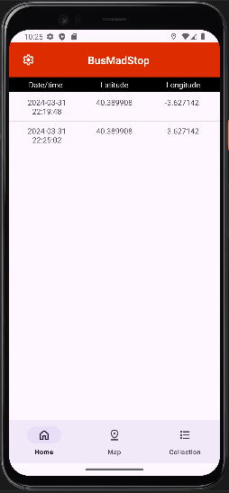
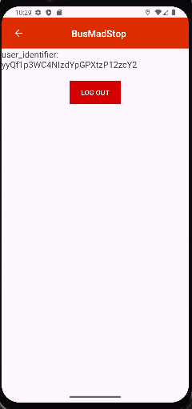

# MadBusStop

## Workspace
Github:  
- Repository: https://github.com/kzzazzk/AugmentingMadrid   
- Releases: https://github.com/kzzazzk/AugmentingMadrid/releases

Workspace: https://upm365.sharepoint.com/sites/MAD_ZLS_SBM/SitePages/Tracking.aspx .  

## Description
Welcome to MadBusStop, your ultimate companion for navigating the bustling streets of Madrid's public transportation network. Designed to simplify the process of finding bus stops throughout the city, MadBusStop offers an array of features to enhance your commuting experience and ensure seamless journeys across Madrid.

## Screenshots and navigation
<table>
  <tr>
    <td>
      
      
First Screen

    </td>
    <td>
      
      
Sign Up

    </td>
  </tr>
  <tr>
    <td>
      
      
Sign In Screen

    </td>
    <td>
      
      
Google Sign In Screen

    </td>
  </tr>
  <tr>
    <td>
      
      
Main Activity Screen

    </td>
    <td>
      
      
Save Coordinates

    </td>
  </tr>
  <tr>
    <td>
      
      
Coordinates Collection Screen

    </td>
    <td>
      
      
Settings Screen

    </td>
  </tr>
    <tr>
    <td>
      
      
Collection Item Screen

    </td>
  </tr>
</table>

## Demo Video
Video demonstrating how the app works (Max 1 video of 1 minute), upload it to a platform like YouTube or Vimeo (it might also work with Stream) and link it here:  

## Features
- Search for all bus stops in Madrid with an Interactive Map.
- Check which bus stops are close to you within a 50m radius.
- Logging in and out with Google or Email.
- Persistence in csv/text fileas
- Persistence in shared preferences
- Firebase authentication
- In Room Database (For the forseable future)
- Maps: Openstreetmaps or Google maps
- Resful APIs used (*e.g., EMT Api https://apidocs.emtmadrid.es *). 
- Menu: *e.g., Toolbar and Bottom Navigation Menu*

## How to Use
Provide instructions on how to get started with the app as user. 
- You must first login and then you can enjoy all of the functionalities BusMadStop has to offer!!!

## Participants
List of MAD developers:
- Zakaria Lasry Sahraoui (z.lsahraoui@alumnos.upm.es)
- Salman Bourhim Messaoudi (s.bourhim@alumnos.upm.es)  

